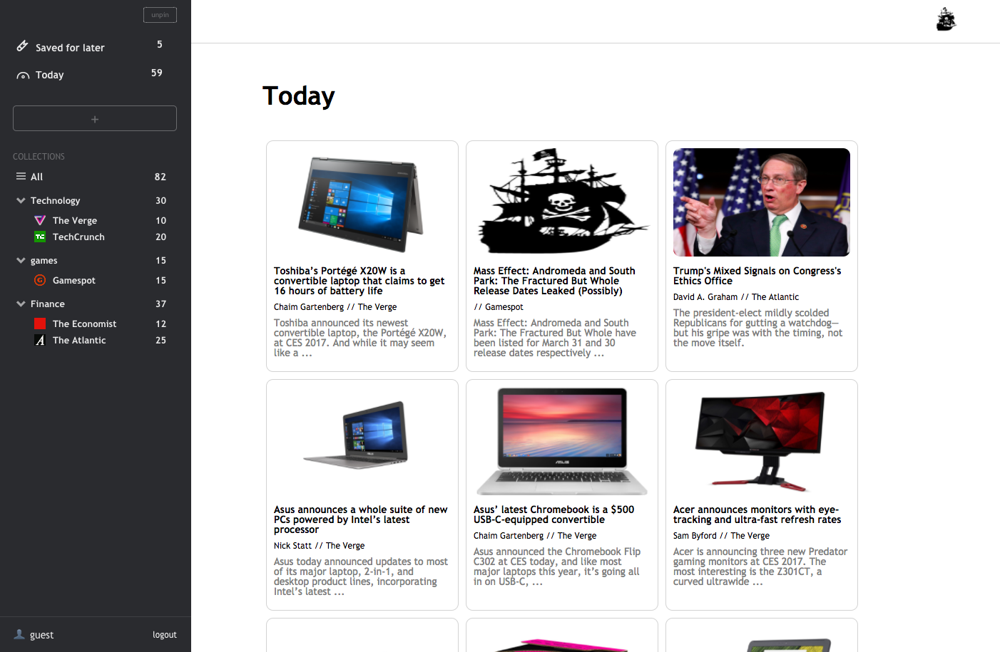
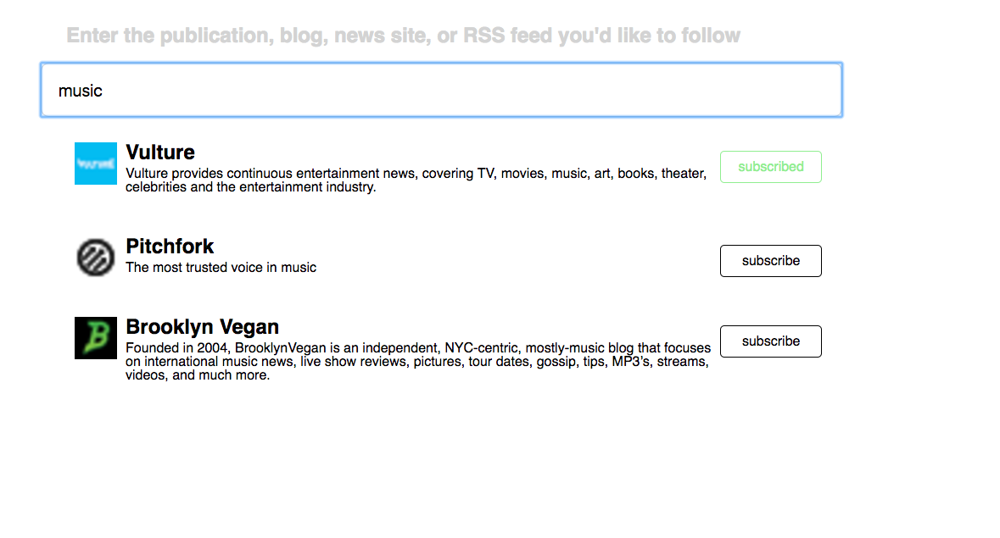

# ARRR!SS-FEED

[ARRR!SS-FEED Live!](https://arrr-ss-feed.herokuapp.com/#/collection_view)

ARRR!SS-FEED is a full-stack web application based on Feedly.  It has a Ruby on Rails backend, PostgreSQL database, and react-redux on the front end for one page functionality.

## Features and Implementation

### Collections and Feeds

  Every user collections indicated by the user_id column in the collections table.  The collections are named groupings of feeds that the user can subscribe to.

  Feeds are hardcoded in on the backend with a title, link, url, and description.  Feeds are subscribed to and put in collections by the subscriptions join table, which has columns for a collection_id and feed_id.

  

### Articles
  all articles from subscribed feeds are obtained from their source sites by ajax call when the site is loaded, and held on to by the react state on the front end.  When a particular view is visited, the articles pertaining to that view are chosen by a selector and rendered.

### Saves
  articles are only saved on the backend when a user chooses the 'Save for Later' option.  It is then saved with all html, along with an entry into a saved_articles join table that references the article and user that saves it.  This way if different users save the same article it will only be in the database once, but with an entry in the join table for each user.  This is accomplished by referencing the article link, which is the only truly unique property of each article since they are not sent with an id with the RSS return data.

  `Save Article method`
  ```ruby
    def create
      @article = Article.find_by(link: params[:article][:link])
      @article ||= Article.new(article_params)
      current_user.articles = current_user.articles.push(@article)
      @user = current_user
      render 'api/users/show'
    end
  ```
  ### Search
    Feeds can be searched by substrings of their descriptions.  Ensuring that the title is in the description, since it is hardcoded and curated on the backend, allows for this to be a robust solution.

  

## Future Content for the Project

  In addition to what is already implemented, I plan to continue working on this project to add the functionality outlined below:

  ### User Profiles
    Users have profiles and can share their collections with other users.

  ### User added feeds
    Besides the curated feeds added on the backend, users can add and subscribe to their own RSS feeds by providing a title, url pointing to the RSS file, and link to the feed source site.  These will not be searchable by other users, since they will not be provided with a way to add a description(which is the feed search parameter)
